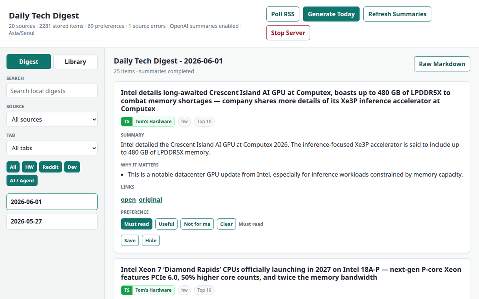

# Daily Tech Digest

A local, Markdown-first web app for curating technical news from RSS feeds, selected subreddits, and Hacker News into a daily digest.

The durable source of truth is `content/digests/YYYY-MM-DD.md`. Runtime state such as normalized items, source health, saved/hidden feedback, preference labels, and temporary fetch metadata lives under `.data/`.

## Requirements

- Node.js 22 or newer
- Optional OpenAI API key for LLM filtering, ranking context, summaries, tags, and why-it-matters text

No Reddit OAuth app is required. Reddit ingestion uses public subreddit RSS feeds plus best-effort public JSON enrichment for new posts.

## Setup

1. Copy `.env.example` to `.env.local`.
2. Optional: set `REDDIT_USER_AGENT`.
3. Optional: set `OPENAI_API_KEY` and `OPENAI_MODEL`.
4. Edit `config/sources.yml` for general RSS/Hacker News sources.
5. Edit `config/reddit-digest.yml` for subreddit list, ranking weights, watchlist terms, and digest limits.

## Poll Sources

Poll all enabled sources and update `.data/items.json`:

```sh
npm run poll
```

Configured adapters:

- `rss`: generic RSS/Atom feeds with ETag and Last-Modified support
- `reddit_rss`: per-subreddit `/new/.rss?limit=100` feeds
- `hackernews`: official Hacker News Firebase API

## Generate A Digest

Generate today's digest:

```sh
npm run digest:today
```

Generate a digest for a specific local date:

```sh
npm run digest -- --date 2026-05-27
```

Digest generation polls first by default, ranks normalized items, runs LLM curation when configured, stores LLM outputs back into `.data/items.json`, and writes Markdown.

## OpenAI Summaries

Some feeds provide source snippets and some do not. Those snippets are not LLM summaries. To generate consistent LLM summaries, add an OpenAI API key to `.env.local`:

```sh
OPENAI_API_KEY=sk-...
OPENAI_MODEL=gpt-5.4-mini
```

Then regenerate the digest:

```sh
npm run digest:today -- --refresh-summaries
```

`--refresh-summaries` forces the app to replace cached LLM summaries for the selected digest candidates. Without that flag, existing LLM summaries are reused to control API cost.

## Web App

Run the local server:

```sh
npm run dev
```

Open <http://127.0.0.1:3847>. The UI supports source filters, tab filters, rendered/raw Markdown, polling, digest generation, LLM summary refresh, save/hide feedback, preference labels, and a Library view for managing historical stored items.



Use the `Library` tab to browse everything stored in `.data/items.json`, including saved items, hidden items, and positive preferences. `Load More` keeps appending older stored items without losing action buttons on appended entries.

Preference labels are persistent and affect future ranking:

- `Must read` and `Useful` are automatically saved and kept visible.
- `Not for me` is automatically hidden.
- `Preferred` in the Library means positive preferences only: `Must read` and `Useful`.

The top bar includes `Stop Server`, which shuts down the local Node server from the browser. Restart it later with `npm run dev`.

## Content Format

Each digest is a Markdown file with:

- `Top 10`
- `HW News`
- `Reddit`
- `Dev`
- `AI / Agent`

Each entry includes source, tab, score/comments when available, hotness, an `LLM Summary`, `Why It Matters`, entities, a separate source snippet, notes, follow-ups, and an `Original` link.

## Tests

```sh
npm test
```

## Notes

- The app stores metadata, snippets, summaries, and links; it does not fetch or republish full article bodies.
- LLM calls are made only after ranking/dedup selects top candidates.
- `plan_RSS.md` is treated as the broad roadmap; `plan.md` reflects the implemented Node.js path.
